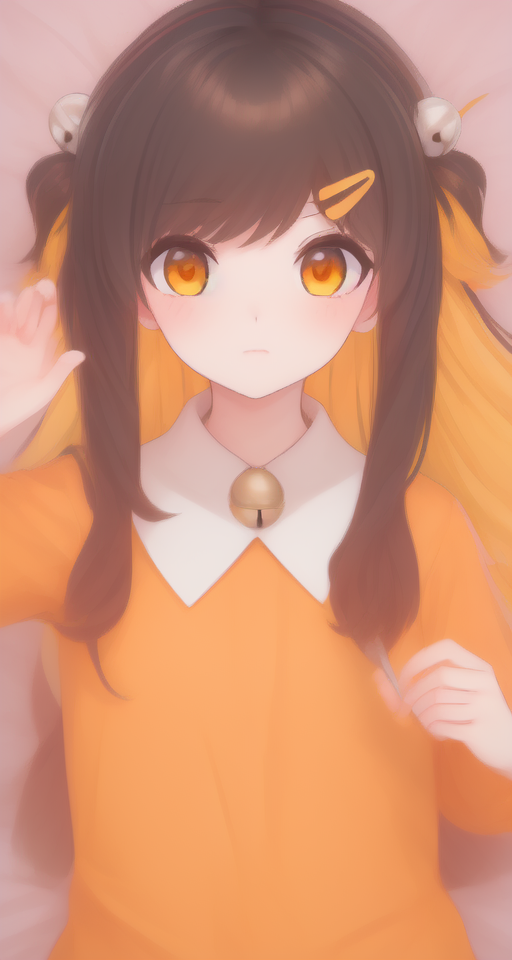
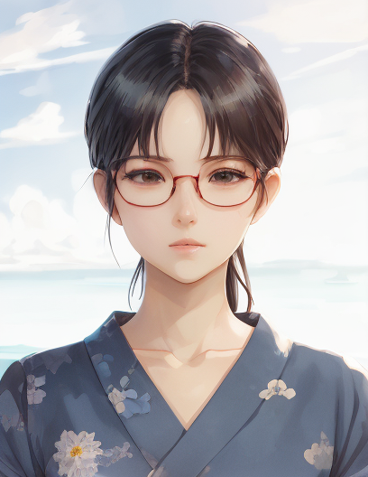
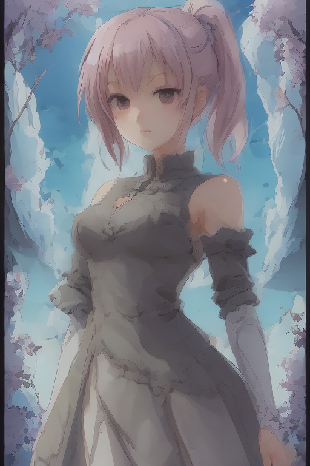

# fasteasySD

<b>fasteasySD</b> is Implementation library of txt2img, img2img function via Latent Consistency Model (LCM) model or LCM_LoRa with SD1.5,SDXL or SSD-1B<br>

LCM Repo : https://github.com/luosiallen/latent-consistency-model

This project is designed to enable simple implementation of SD capabilities within other projects

Additionally, This project is designed to work with 'cpu' standalone settings in addition to 'cuda' devices.

~~by creating a comfyUI-lcm extension in a standalone library format.~~

Change to full diffusers base (LCMS scheduler and LCM model support officially updated in the diffusers project in Huggingface.)

### 2023.11.14
add LCM_LoRa support :

With the announcement of LCM_LoRa, support for SD models based on existing SD1.5, SDXL, and SSD-1B is added.

and also support custom lora(locon) with LCM_LoRa (Refer to the lower example image.)

~~Original version of comfyUI-lcm : <br>
https://github.com/0xbitches/ComfyUI-LCM~~

[](
https://pypi.org/project/fasteasySD/)

# Example Result (CPU Only):

## SD, SDXL txt2img result
 

### *Warning* this img is made with custom lora (Twitch_chamcham , Genshin Ganyu).

## SD, SDXL img2img result


## LCM img2img result

 

### *Warning* Even if the original is a male image, sometimes it can be converted to a female image. so please Set prompt more accurately.

## LCM txt2img result
 

# Usage

<b>This library supports two functions: txt2img and img2img.</b>

### simplest Usage

```Python
#import fasteasySD
from fasteasySD import fasteasySD as fesd

test = fesd.FastEasySD(device='cpu',use_fp16=False)

"""test.make_image(mode="txt2img",
                model_type="SD",model_path="milkyWonderland_v20.safetensors",
                lora_path=".",lora_name="chamcham_new_train_lora_2-000001.safetensors",
                prompt="sharp details, sharp focus, anime style, masterpiece, best quality, chamcham(twitch), hair bell, hair ribbon, multicolored hair, two-tone hair, 1girl, solo, orange shirt, long hair, hair clip",
                n_prompt="bad hand,text,watermark,low quality,medium quality,blurry,censored,wrinkles,deformed,mutated text,watermark,low quality,medium quality,blurry,censored,wrinkles,deformed,mutated",
                seed=0,steps=8,cfg=2,height=960,width=512,num_images=1)"""

test.make_image(mode="txt2img",
                model_type="SDXL",model_path="x2AnimeFinal_gzku.safetensors",
                lora_path=".",lora_name="ganyu2x_xl.safetensors",
                prompt="sharp details, sharp focus, ganyu (genshin impact),breasts,horns,blue hair,purple eyes,blush,gloves,bell,bare shoulders,bangs,black gloves,detached sleeves,neck bell,ahoge,sidelocks,goat horns,",
                n_prompt="bad hand,text,watermark,low quality,medium quality,blurry,censored,wrinkles,deformed,mutated text,watermark,low quality,medium quality,blurry,censored,wrinkles,deformed,mutated",
                seed=0,steps=8,cfg=2,height=1024,width=1024,num_images=1)

test.make_image(mode="img2img",
                model_type="SD",model_path="milkyWonderland_v20.safetensors",
                prompt="sharp details, sharp focus, glasses, anime style, 1man",
                seed=0,steps=4,cfg=2,height=960,width=512,num_images=1,prompt_strength=0.3,input_image_dir="input.jpg")
```

# installation

<b>Make Sure Install the Pytorch version for your system.</b>

find install Pytorch : https://pytorch.org/get-started/locally/

```bash
pip install fasteasySD 
```

# Documentation

<b>Provides simple documentation for this library.</b>

## FastEasySD

<b>Main class for LCM model control.</b>

### functions

FastEasySD class function list<br>
```Python
class FastEasySD:
    """ LCM model pipeline control class.

    Create and manage pipeline objects for LCM models,
    It has functions that process the pipeline input and output values as its main methods.

    """

    def __init__(self, device:str, use_fp16:bool):

        """ Class constructors.

        device : device to use (ex: 'cpu' or 'cuda').

        use_fp16 : Enable fp16 mode. (bool) (Not supported by most cpu devices.)

        """

    def __makeSampler(self):
        """ Create a txt2img, img2img sampler object. (automatic load with init)

        Create sampler objects for LCM model use.

        """
    
    def make_seed(self,seed: int, random_seed:bool) -> int:

        """ Automatically generate seed value (random number)

        Automatically generate seed value (random number)

        seed : user input seed value (int)

        random_seed : True, False for use random_seed
        
        """
    
    def __load_img(self,img_dir:str):

        """ Load image file for img2img input

        Load the file specified in img_dir and return it to the form available in img2img sampler.

        img_dir : path for input img.

        """
    
    def save_PIL(self,pils,save_name):

        """ PIL image list storage function.

        Store a list of PIL images generated by the LCM model.

        pils : list of PIL images

        save_name : Set image save filename. (ex: {save_name}_1.png)

        """
    
    def return_PIL(self,images):

        """ Converts LCM Model Tensor results to a PIL list.

        Converts the Tensor list generated through the LCM model to a PIL list.

        images : LCM pipeline output tensor

        """
    
    def i2i_batch_save(self,images_list,base_name):

        """ Save img for img2img result values.

        First clean up the Tensor list generated by img2img function.

        and save img2img result.

        images_list : LCM img2img pipeline output tensor list.

        base_name : base name for saving img. (ex : {base_name}_{save_name}_1.png)

        """

    def make(self,mode:str,model_path:str,model_type:str,lora_path:str,lora_name:str,**kwargs):
        
        """ Process user input and forward it to the LCM pipeline.

        Forward variable values for image creation to the LCM pipeline and return the corresponding result values

        mode : string for LCM mode (txt2img or img2img)
        
        model_path : path for model (huggingface repo id or path str)
        
        model_type : type of model ("LCM","SD","SDXL","SSD-1B")
        
        lora_path : path of lora file (ex : "./path/for/lora")
        
        lora_name : name for lora file (ex : "test.safetensor")
        
        input_image_dir : (only for img2img) input image dir

        output_image_dir : output image dir (it will not make dir)

        prompt : model input prompt (ex : "masterpeice, best quality, anime style" )
        
        n_prompt : model negative input prompt (ex : "nsfw,nude,bad quality" )

        seed : seed for LCM model (input 0 will make random seed)

        steps : steps for LCM model (recommend 2~4)

        cfg : cfg for LCM model (recommend 6~8)

        height , width : setting height and width for img (** if you are using img2img w and h should be the same as the input image. **)

        num_images : How many images will you create for this input

        prompt_strength : (only for img2img) How Strong will the prompts be applied in the img2img feature

        """
        
    def make_image(self,mode:str,model_path:str=None,model_type:str="LCM",lora_path:str=None,lora_name:str=None,output_image_dir:str=".",**kwargs):
        
        """ Most Simplified Image Generation Function

        Save the image generated by the txt2img, img2img function as a separate file based on user input.

        the output img will be save like output_image_dir/fesd_0.png(txt2img) or output_image_dir/fesd_i2i_0_0.png(img2img)

        mode : string for LCM mode (txt2img or img2img)
        
        model_path : path for model (huggingface repo id or path str)
        
        model_type : type of model ("LCM","SD","SDXL","SSD-1B")
        
        lora_path : path of lora file (ex : "./path/for/lora") ( if you want to use with huggingface repo than paste repo id )
        
        lora_name : name for lora file (ex : "test.safetensor") ( if you want to use with huggingface repo than set this param as None )
        
        input_image_dir : (only for img2img) input image dir

        output_image_dir : output image dir (it will not make dir)

        prompt : model input prompt (ex : "masterpeice, best quality, anime style" )
        
        n_prompt : model negative input prompt (ex : "nsfw,nude,bad quality" )

        seed : seed for LCM model (input 0 will make random seed)

        steps : steps for LCM model (recommend 2~4)

        cfg : cfg for LCM model (recommend 6~8)

        height , width : setting height and width for img (** if you are using img2img w and h should be the same as the input image. **)

        num_images : How many images will you create for this input

        prompt_strength : (only for img2img) How Strong will the prompts be applied in the img2img feature

        """

```
### Usage example : 

```Python
from fasteasySD import fasteasySD as fesd

test = fesd.FastEasySD(device='cpu',use_fp16=False)

mode = "img2img"

images = test.make(mode=mode,
                model_type="SDXL",model_path="x2AnimeFinal_gzku.safetensors",
                lora_path=None,lora_name=None,
                prompt="sharp details, sharp focus, ganyu (genshin impact),breasts,horns,blue hair,purple eyes,blush,gloves,bell,bare shoulders,bangs,black gloves,detached sleeves,neck bell,ahoge,sidelocks,goat horns,",
                n_prompt="bad hand,text,watermark,low quality,medium quality,blurry,censored,wrinkles,deformed,mutated text,watermark,low quality,medium quality,blurry,censored,wrinkles,deformed,mutated",
                seed=0,steps=4,cfg=2,height=960,width=512,prompt_strength=0.4,num_images=1)

if mode == "txt2img":
            
    pil_images = test.return_PIL(images)

    test.save_PIL(pils=pil_images,save_name="./fesd")

elif mode == "img2img":
            
    test.i2i_batch_save(images_list=images,base_name="./fesd_i2i")

```

# Additional Plan Scheduled

<b>add batch mode for img2img input.</b>

<b>add controlnet support</b>

# Tech Stack

Python<br>